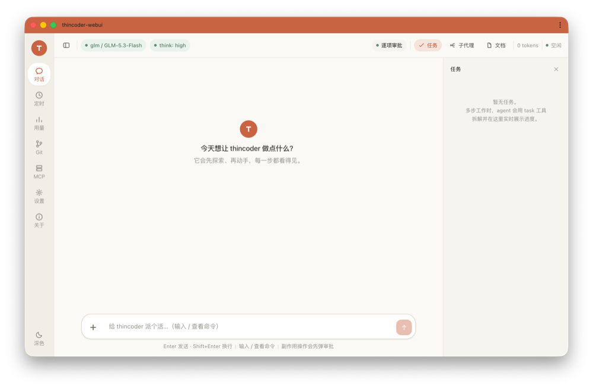
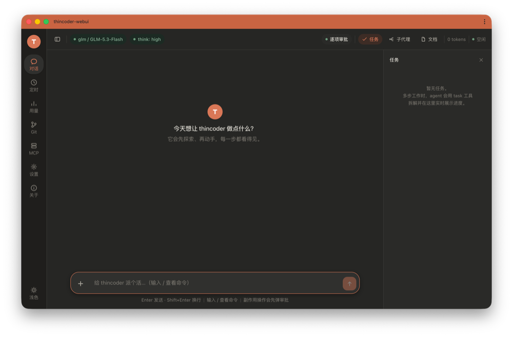
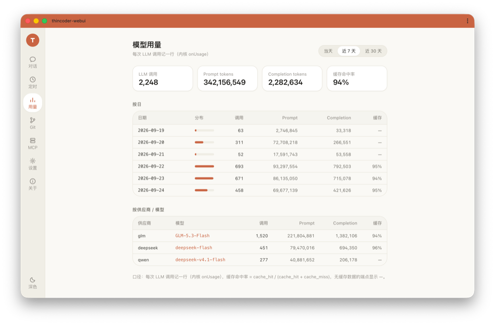
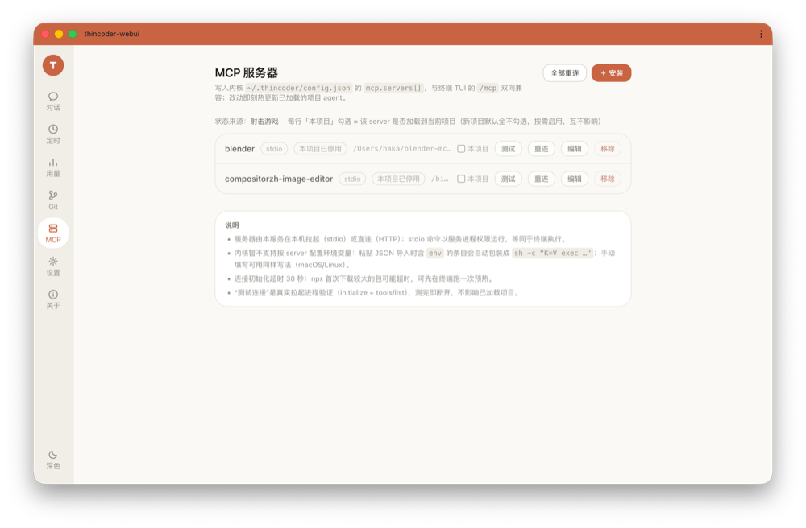
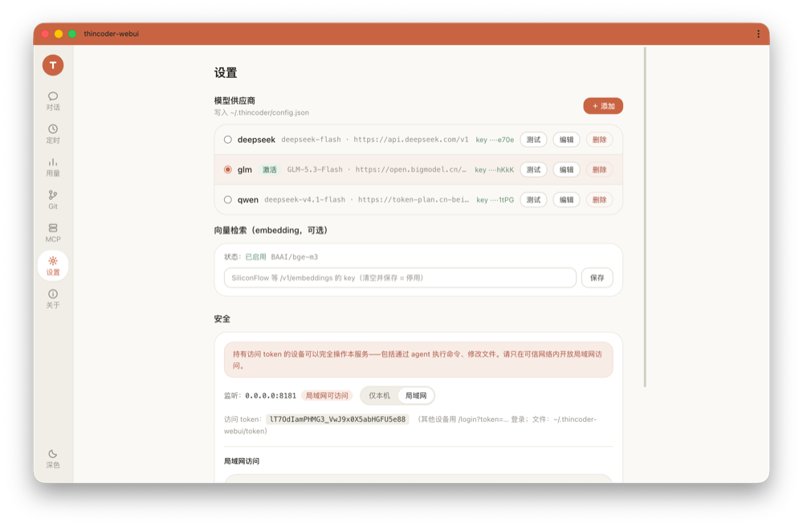
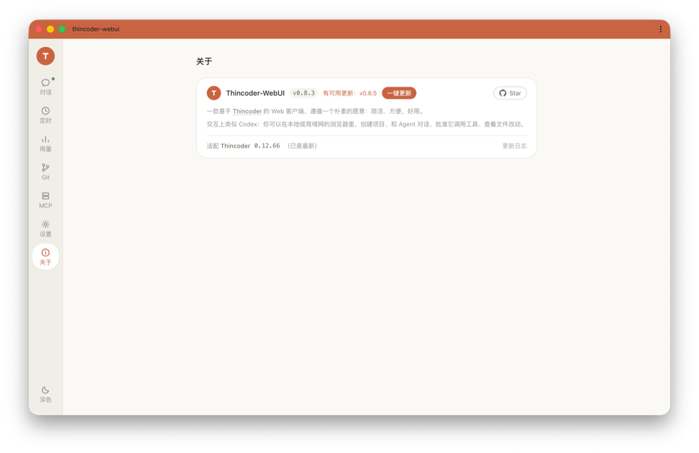
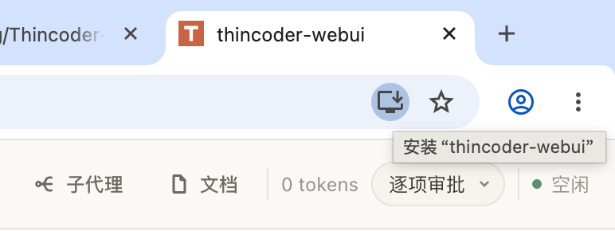
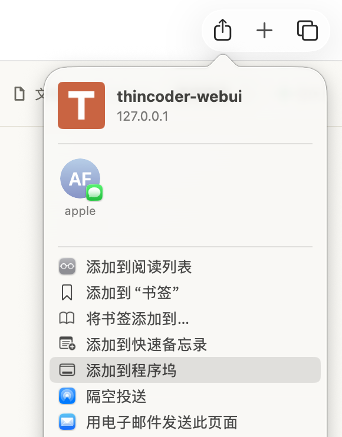

# Thincoder-WebUI

一款基于 [Thincoder](https://gitee.com/shanghai-xinbo/thincoder) 的 Web 客户端，遵循一个朴素的愿景：简洁、方便、好用。

交互上类似 Codex：你可以在本地或局域网的浏览器里，创建项目、和 Agent 对话、批准它调用工具、查看文件改动。

> **项目理念：** 这个项目最初只是自用的工具，后来慢慢做成了开源项目。原则很简单：只做高频、核心的功能，并把它们做扎实、做顺手；不常用的功能，不硬塞、不堆砌。如果你也在找一个「打开浏览器就能盯着 agent 干活」的轻量工作台，它应该正合适。

## 项目背景

[thincoder](https://gitee.com/shanghai-xinbo/thincoder) 是一个零依赖 Node 编码 agent（终端 TUI 形态）。内核作者把权限设计成「由 UI 层决定问不问用户」（`onPermissionRequest` 回调），本项目就是接在那个缝上的**新 UI 层**：

- **不改内核**——全部工作 = 桥接层（`server/`，纯 Node 零第三方依赖）+ 前端（`web/`，React + Vite），通过动态 import 复用内核模块；
- 内核升级时桥接层做适配重对，WebUI 自身功能不随内核漂移。

## 功能一览

- **流式工作台**：SSE 事件流，工具调用全程可视（含子 agent、思考流、实时命令输出、任务进度）
- **审批三档 + Diff 审阅**（对齐 Codex）：Suggest / Auto Edit / Full Auto；write/edit/delete 审批前展示真实 unified diff（统一/并排视图）
- **会话管理**：列表 / 恢复 / 自动归档 / 归档删除，与终端 TUI 双向兼容；刷新页面时间线自动重建
- **会话回退与复制**：一键复制用户消息；可回退到「这条消息发出之前」——对话历史与期间的文件增删改一起撤销，回退本身还可撤销
- **子代理面板**：agent 派发的子任务在右侧独立面板逐条显示进度（本轮视图）；**完成报告以可折叠块进对话**，展开可读原文，不与回复正文混排
- **任务面板与 Plan 模式**：右侧任务进度面板；PLAN 横幅 + 方案卡确认
- **配置中心**：供应商增删改/激活/连接测试（key 脱敏），写内核 `~/.thincoder/config.json`
- **用量看板**：每次 LLM 调用落库（node:sqlite），按日/按模型聚合
- **定时任务 / MCP 管理 / 追问建议 / 局域网手机访问（二维码）** 等辅助能力

## 界面预览

左边导航、中间对话、右侧任务与子代理面板，主要界面就这么几个（点击图片可看原图）：

<p align="center">
  <a href="docs/screenshots/chat-light.png"></a>
  <a href="docs/screenshots/chat-dark.png"></a>
  <a href="docs/screenshots/usage.png"></a>
</p>
<p align="center"><sub>对话工作台（浅色 / 深色两套主题）· 用量看板</sub></p>

<p align="center">
  <a href="docs/screenshots/mcp.png"></a>
  <a href="docs/screenshots/settings.png"></a>
  <a href="docs/screenshots/about.png"></a>
</p>
<p align="center"><sub>MCP 服务器 · 设置 · 关于</sub></p>

## 环境要求

- **Node.js ≥ 22.5**
- [thincoder](https://gitee.com/shanghai-xinbo/thincoder) 内核（通过 npm 依赖自动安装，无需全局安装）
- 现代浏览器（Chrome / Edge / Safari / Firefox 均可）

## 快速开始

```bash
git clone https://github.com/hzchrisfang/Thincoder-WebUI.git
cd Thincoder-WebUI

# 1. 安装依赖（含 thincoder 内核与前端构建依赖，postinstall 会自动给内核打一个兼容补丁）
npm install

# 2. 构建前端（产物输出到 server/static）
npm run build

# 3. 启动服务（默认 0.0.0.0:8181）
npm start
```

首次启动会生成持久访问 token（`~/.thincoder-webui/token`，权限 0600）。终端会打印登录链接，或手动拼：

```bash
cat ~/.thincoder-webui/token
# 浏览器打开 http://localhost:8181/login?token=<上一步的内容>
```

登录后：**添加项目目录（白名单制）→ 选一个模型供应商 → 发起对话**。局域网设备（如手机）访问 `http://<你的IP>:8181` 用同一 token 登录即可（登录页有二维码）。

## 装成「应用」用（像本地软件一样打开）

不习惯在浏览器标签页里用它？Chrome / Edge 和 Safari 都能把它变成一个独立窗口的应用：有自己的图标，点开即用，没有地址栏与标签页，和别的软件一样待在程序坞 / 开始菜单里。

- **Chrome / Edge（Chromium 系）**：打开 WebUI，点地址栏右侧的「安装」图标 → 在弹出的提示里点「安装」。
- **Safari（macOS）**：点工具栏的分享按钮 → 「添加到程序坞」。（分享菜单里没有这一项，说明系统版本较旧，升级 macOS 后就有。）

<p align="center">
  
  
</p>
<p align="center"><sub>左：Chrome 地址栏右侧的「安装」入口　右：Safari 分享菜单里的「添加到程序坞」</sub></p>

装好之后第一次打开若提示未授权，用登录链接 `http://localhost:8181/login?token=…` 打开一次即可（登录状态保存 1 年）；token 存于 `~/.thincoder-webui/token`。手机端同理——Safari / Chrome 的分享菜单里选「添加到主屏幕」。

## 更新

更新只换代码与前端产物，不碰数据：访问 token、项目白名单、用量库在 `~/.thincoder-webui`，会话记录与内核配置在 `~/.thincoder`（内核数据目录）——都不在代码目录里。

### 一键更新（推荐）

打开左侧导航的「关于」页（见上方界面预览），它会自动去公开仓查最新版本：显示「已是最新」就不用管；显示「有可用更新：vX.Y.Z」时旁边会出现「一键更新」按钮——点它、确认，服务端依次自动完成 **拉取新代码（`git fetch` + 快进合并）→ 安装依赖 → 重新构建前端 → 自动换入**，全过程在页面上实时打日志（关掉页面也继续跑，重开自动恢复）。

**完成后需手动重启服务**：在启动服务的那个终端按 `Ctrl+C` 停掉，再 `npm start`。

几个前置条件（不满足会拒绝并说明原因，不会硬来）：

- 目录必须是**从公开仓 clone 出来的 git 仓库**——fork 过、改过代码、与公开仓历史分叉的会被拒绝，需手动处理；
- **工作树必须干净**：有未提交的改动会被拒绝（不会自动 stash），请先提交或另存；
- **不能有任务在跑**：任一项目正在跑 agent 时会拒绝，等跑完再更新；
- 更新期间不要在本机对 WebUI 目录执行别的 `git` / `npm` 命令。

万一失败，会停在失败的那一步并在页面显示步骤名与日志；失败之前已完成的部分保留（比如代码已经拉下来），正在服务的旧版前端不受影响，可以排查后重试。

### 手动更新

和上面是同一件事，自己敲命令：

```bash
cd Thincoder-WebUI

git pull           # 拉取新代码
npm install        # 依赖有变化时装（postinstall 会重新给内核打兼容补丁）
npm run build      # 重新构建前端，产物落在 server/static

# 重启服务：在启动终端按 Ctrl+C 停掉，再
npm start
```

> 服务不会热更新：改完代码、构建完，都要重启才生效。每个版本改了什么见 [CHANGELOG.md](./CHANGELOG.md)。

## 安全须知

- 服务**默认监听 `0.0.0.0`**，局域网内任何知道 token 的人都能操作你的 agent——token 请妥善保管，不要部署到公网。
- agent 有文件读写与命令执行能力，审批档位（Suggest / Auto Edit / Full Auto）决定它多大程度自主行动，请按自己的信任程度选择。

## 免责声明

本项目按「现状」提供（MIT License，见 [LICENSE](./LICENSE)），不含任何明示或默示的担保。这是一个个人维护的开源工具，作者不对使用本项目造成的任何直接或间接损失负责；请自行评估在重要项目中使用 agent 的风险（代码变更可在审批弹窗逐条审阅）。

> 版本说明：本仓库版本号与作者内部开发仓保持同步，历史版本号可能不连续，属正常现象；更新内容见 [CHANGELOG.md](./CHANGELOG.md)。

## License

[MIT](./LICENSE) —— 可自由使用、修改、商用，唯一要求是分发时保留原始的版权声明与许可证文本；软件按「现状」提供，不含任何担保（详见上方免责声明）。
